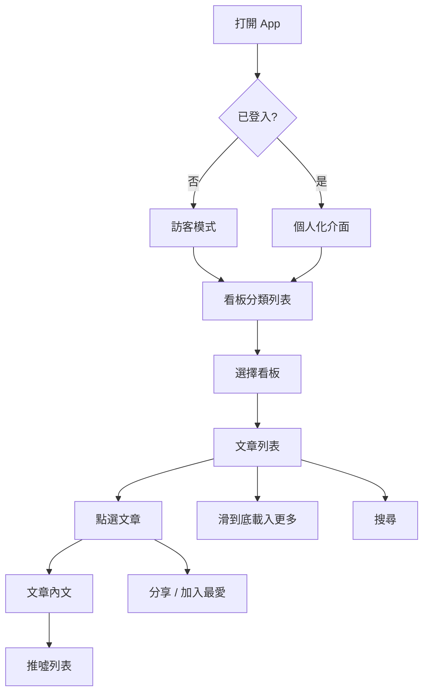
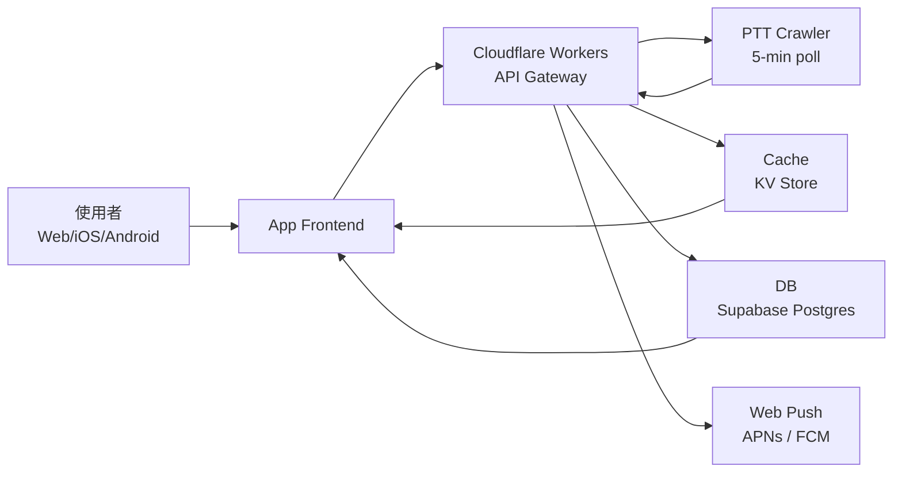

# OpenPTT — 全平台 PTT 看板瀏覽器 — 規格計劃書 v3.0

> 版本:v3.0｜更新日期:2026-08-09｜維護者:Hermes Agent for Sean
> 對接技術:Hermes Agent(規格起草)+ 待定 CTO
> 本次動機:**100% 仿做 BePTT iOS App,擴展為 Web + iOS + Android 全平台**,解決 BePTT iOS-only、Android/Web 用戶被迫用不友善網頁版的問題。
> Notion: https://app.notion.com/p/OpenPTT-PTT-App-BePTT-100-3c4449ca65d8817c8633f3d808910ed5

---

## 1. 產品概述 (Product Overview)

### 1.1 問題陳述 (Problem Statement)

**市場現況**:

- **BePTT**(App Store id1522407507)是台灣 PTT 用戶最愛的看板 App 之一,但**僅限 iOS**,Android 與 Web 用戶無法使用
- **PTT 網頁版**(www.ptt.cc)介面過時、行動裝置體驗差:字小、橫向滑動、推噓 UI 亂
- **其他 PTT App**(Pitt、MeowPTT、Moptt、JPTT)各家功能定位不同,沒有一個「乾淨 + 跨平台 + 訂閱推播 + 深色模式」全包的選擇
- **桌面使用者**(工程師、分析師、記者)工作時需要快速瀏覽 PTT,但被迫用手機或難用的網頁

**真正的目標族群**(排除付費意願低的):

| 族群 | 規模估算 | 痛點 | 付費意願 |
|---|---|---|---|
| **桌面瀏覽者**(工程師/分析師/記者) | 20 萬 | 工作中需要快速看 PTT 看板,但手機 iOS-only 或網頁太難用 | NT$0(免費版足夠) |
| **Android 用戶** | 80 萬 | BePTT 沒有 Android 版,只能網頁 | NT$99-299/年(訂閱無廣告) |
| **PTT 重度跨板使用者** | 5 萬 | 想一次看 5-10 個板,需要個人化快速切換 | NT$199-499/年 |
| **海外台灣人** | 10 萬 | 留學生/出差工作者,只能用網頁 | NT$0-99/年 |

**TAM 估算**:至少 100 萬用戶(免費 + 訂閱混合),保守 5% 付費轉化 = 5 萬付費用戶 × NT$150/年 = **NT$750 萬/年 ARR**

### 1.2 目標使用者 (User Personas)

#### Persona A — 「Alex」28 歲後端工程師(Web 為主)

- **規模**:15 萬(PTT 工程師社群 + 中文 Reddit 跨平台使用者)
- **痛點**:每天上班前用電腦看 Tech_Job 板與 Gossiping 板;BePTT iOS-only,他工作時只有 MacBook;網頁版廣告多、介面混亂
- **既有方案失敗原因**:網頁版無法同步最愛看板;其他 PTT App 都是 iOS
- **我們的解法**:Web PWA + localStorage 同步最愛 + 系統深色模式自動偵測
- **付費意願**:NT$99-199/年(無廣告 + 跨裝置同步)

#### Persona B — 「Betty」22 歲大學生(Android 為主)

- **規模**:80 萬 Android 使用者
- **痛點**:BePTT 沒有 Android 版;她每天用 Gossiping 板,字太小、推噓按不到
- **既有方案失敗原因**:iOS App 她用不到;網頁版無 native UI
- **解法**:Android App,native UI 元件 + Material 3
- **付費意願**:NT$0-49/年(學生預算低,但願意付小額去廣告)

#### Persona C — 「Charlie」35 歲鄉民重度使用者(跨板 + 訂閱)

- **規模**:5 萬(重度跨板使用者 + 推文爆文獵人)
- **痛點**:一次想看 5 個板(Stock / Tech_Job / Gossiping / NBA / Baseball),需要個人化「最近瀏覽 + 我的最愛」橫向切換;新文章爆文要即時通知
- **既有方案失敗原因**:BePTT 沒有多板快速切換;推文推送需手動刷新
- **解法**:多板 Dashboard + Web Push 訂閱通知
- **付費意願**:NT$299-499/年(訂閱 + 推播)

#### Persona D — 不做(Non-Persona)

- ~~PTT 發文者(鄉民本人)~~:Notion 上已有 PTT-Alertor 系列,我們不做「寫」的 App,只做「看」
- ~~想登入 PTT 帳號(回文 / 收信)~~:法律灰色地帶、BePTT 已有,我們只做訪客模式

### 1.3 核心價值主張 (Value Proposition) — ★ vs Top 3 競爭者

> **「OpenPTT 是唯一全平台( Web + iOS + Android)且免費可用的 PTT 看板瀏覽器,提供 native UI 體驗、深色模式自動偵測、多板快速切換、可選無廣告訂閱。」**

**vs Top 3 競爭者差異化**:

| 競爭者 | 限制 | 我們差異化 |
|---|---|---|
| **BePTT**(iOS only) | 沒 Android / Web | 全平台 |
| **PTT 網頁版** | 介面過時、廣告多、推噓 UI 不友善 | 重新設計 UI、深色模式 |
| **其他 PTT App**(Pitt / MeowPTT / Moptt / JPTT) | 各有功能缺點、沒有跨平台一致體驗 | 一套 code,跨三平台 |

### 1.4 商業目標 (KPIs / OKRs)

#### 6 個月目標(2026 Q3-Q4)

- **O1 - 取得 PMF**:
  - KR1:10,000 名 MAU(從 Ptt-Alertor + Stock 板 + Tech_Job 板導流)
  - KR2:500 名付費用戶(5% 付費轉化率)
  - KR3:NT$50,000 MRR(500 × NT$100 均價)
  - KR4:留存率 D30 ≥ 35%

#### 12 個月目標(2027 Q1)

- **O2 - 規模化**:
  - KR1:50,000 MAU
  - KR2:3,000 付費用戶
  - KR3:NT$300,000 MRR
  - KR4:跨平台占比 Web 50% / iOS 30% / Android 20%

### 1.5 ⭐ Non-Goals (明確不做)

- ❌ **登入 PTT 帳號**(沒推噓回文 — MVP 純閱讀)
- ❌ **發文 / 編輯文章**(避免法律 + 灰色地帶)
- ❌ **私人訊息 / 信箱**
- ❌ **WebSocket 即時推播**(MVP 用 polling)
- ❌ **自訂主題 / CSS**(MVP 預設主題就夠)
- ❌ **影片內容支援**(PTT 影音板不在 MVP)

---

## 2. 使用者場景與流程

### 2.1 使用者流程圖



### 2.2 關鍵用戶故事 (User Stories)

**US-1**:作為後端工程師 Alex,我想要在 MacBook 打開 Chrome 看 Tech_Job 板,這樣上班前就知道當天的新職缺。

- 驗收:Chrome 打開網址、Tech_Job 板載入時間 < 2 秒

**US-2**:作為 Android 用戶 Betty,我想要一個原生 Android App,字大小可調、有 Material 3 元件。

- 驗收:Play Store 上架、Material 3 元件正常

**US-3**:作為重度使用者 Charlie,我想要把我的 5 個最愛看板做成橫向 Dashboard。

- 驗收:Dashboard 可拖拽排序、localStorage + 雲端同步

**US-4**:作為海外用戶,我想要在海外也能讀 PTT 文章,VPN 不穩時也能看快取。

- 驗收:離線模式可讀已瀏覽文章

**US-5**:作為任何用戶,我想要推爆文時收到通知。

- 驗收:Web Push / APNs / FCM 推播成功

### 2.3 邊界場景 (Edge Cases)

- **EC-1**:PTT 網站暫時掛掉 → 顯示快取內容 + 「上次更新於 X 分鐘前」標籤
- **EC-2**:圖片 404 → 顯示 placeholder + 重新載入按鈕
- **EC-3**:推噓列表超過 1000 樓 → 預設顯示前 50 樓 + 「展開全部」按鈕
- **EC-4**:看板不存在 → 顯示「看板不存在」友善訊息
- **EC-5**:使用者取消推播權限 → 退回 polling 模式,UI 顯示「通知關閉」

---

## 3. 功能性需求 (Functional Requirements)

### 3.1 MVP(必做,P0)

#### P0-1. 看板列表瀏覽(分類 + 熱門)

- 看板分類樹狀列表(Gossiping > 分區 > NBA 等)
- 熱門看板 Top 20 列表
- 看板資訊卡:看板名稱 + 文章數 + 在線人數 + 板主

#### P0-2. 文章列表(分頁載入 + 排序)

- 看板進入後,顯示分頁文章列表(每頁 20 篇)
- 排序:最新 / 熱門(>100 推)/板主推薦
- 顯示欄位:作者、標題、推/噓/箭頭數、發文時間、標籤(Re: / Fw:)
- 圖片縮圖 inline

#### P0-3. 文章內文閱讀(完整功能)

- 完整內文 + 推噓列表(預設前 50 樓)
- 圖片 lazy load、點擊放大
- 文字長按複製、URL 長按開啟
- HTML render 但 sanitize(XSS 防護)

#### P0-4. 我的最愛(localStorage + 雲端可選)

- 加入/刪除最愛看板
- localStorage 永久保存(訪客)
- 雲端同步(註冊用戶可選)
- 拖拽排序

#### P0-5. 深色模式(系統偵測 + 手動切換)

- 自動偵測系統 prefers-color-scheme
- 手動切換:淺色 / 深色 / 跟隨系統
- 持久化設定

### 3.2 v2(加值,P1)

#### P1-1. 看板 / 文章搜尋

- 全文搜尋(標題 + 內文 + 作者)
- 看板範圍:全部 / 單一板
- 結果分頁

#### P1-2. 文章分享(URL + Web Share API)

- 複製 URL
- Web Share API(行動裝置 native share sheet)
- QR code 分享(桌面版)

#### P1-3. 多板 Dashboard

- 個人化橫向切換列
- 「最近瀏覽 + 我的最愛」分組
- 拖拽排序 + 釘選

#### P1-4. 訂閱推播(Web Push / APNs / FCM)

- 訂閱新文章通知(每看板每 30 分鐘最多 1 次)
- 推爆文即時通知(>100 推)
- 預設關閉(使用者主動開啟)

### 3.3 v3(探索,P2)

- 圖文解析(Memoji / OCR)
- 文章情緒分析(正面/負面)
- 跨帳號最愛同步(Firebase / Supabase)
- 看板熱度排行榜

### 3.4 ⭐ Acceptance Criteria (Given/When/Then)

#### MVP 核心

- **Given** 使用者打開 Web / iOS / Android App **When** 點選看板 **Then** 2 秒內載入文章列表
- **Given** 使用者點選文章 **When** 進入閱讀頁 **Then** 顯示完整內文 + 推噓前 50 樓
- **Given** 使用者加入最愛看板 **When** 重啟 App **Then** 最愛仍然存在(localStorage / 雲端)

#### 跨平台一致性

- **Given** iOS / Android / Web 任一平台 **When** 同一個登入帳號 **Then** 最愛看板同步

#### 推播

- **Given** 使用者訂閱「Stock」板推爆文通知 **When** 有新文 >100 推 **Then** 5 分鐘內收到推播

---

## 4. 系統設計 (System Design)

### 4.1 技術棧 (Tech Stack)

#### Web (PWA)

- **前端**:React 18 + Vite + TypeScript
- **UI**:Tailwind CSS + Radix UI(無障礙元件)
- **狀態管理**:Zustand + React Query
- **PWA**:Workbox(service worker)
- **Router**:React Router 6

#### iOS / Android(共用)

- **首選方案**:Capacitor(把 Web 版本包成 native app,共用 95% code)
- **進階方案**:React Native(完全原生,但需雙倍維護成本)
- **MVP 建議**:Capacitor(開發快、後續可升級 RN)

#### 後端 / API

- **方案 A**:Vercel Serverless Functions(免費額度內夠用)
- **方案 B**:Cloudflare Workers(更快、push 支援更完整)
- **首選**:Cloudflare Workers(免費額度大、edge 部署)

#### 資料來源

- **PTT 網頁版 HTML parse**(公開,但有被擋風險)
- **開放資料集**:
  - [PTT-Web-Crawler](https://github.com/ptt/ptt-web-crawler) — Python 開源爬蟲
  - [RSSHub PTT route](https://docs.rsshub.app/routes/other#p-t-t-tai-wan) — RSS feed
- **頻率策略**:
  - 熱門板(Stock / Gossiping / Tech_Job):每 3 分鐘
  - 一般板:每 10 分鐘
  - 冷門板:每 30 分鐘
- **Proxy pool**:Cloudflare Workers + 多 IP(proxy rotation)

### 4.2 系統架構圖 (Mermaid)



### 4.3 資料模型

#### Board(看板)

```typescript
interface Board {
  id: string              // "Stock", "Gossiping"
  name: string            // "Stock 股票板"
  category: string        // "財經"
  onlineCount: number     // 在線人數
  articleCount: number    // 今日新文數
  isHot: boolean          // 是否熱門
}
```

#### Article(文章)

```typescript
interface Article {
  id: string              // "{board}.{articleId}"
  boardId: string
  title: string
  author: string
  content: string         // HTML
  publishTime: Date
  pushCount: number
  booCount: number
  arrowCount: number
  isHot: boolean          // pushCount >= 100
  isPush: number          // -1=箭頭 0=普通 1=推 2=爆
}
```

#### Favorite(我的最愛)

```typescript
interface Favorite {
  userId?: string         // 可選,訪客為空
  boardId: string
  order: number           // 排序
  createdAt: Date
}
```

### 4.4 API 規格 (REST endpoints)

```
GET /api/boards              → 看板列表(支援 ?category=xxx)
GET /api/boards/{id}         → 看板資訊
GET /api/boards/{id}/articles → 文章列表(支援 ?page=N&sort=hot|newest)
GET /api/articles/{id}       → 文章內文 + 推噓
GET /api/search?q=xxx&board=xxx → 搜尋結果
POST /api/favorites          → 加入最愛(需登入)
DELETE /api/favorites/{boardId} → 刪除最愛
POST /api/push/subscribe     → 訂閱推播(需 push subscription)
```

---

## 5. 非功能性需求 (Non-Functional Requirements)

### 5.1 性能指標

- **首次載入(FCP)**:< 1.5 秒(PWA 預先快取)
- **看板切換(TTI)**:< 1 秒(localStorage cache)
- **文章列表載入**:2 秒內(分頁 20 篇)
- **離線可用**:已瀏覽看板 + 最後一次文章快取
- **Lighthouse 評分**:> 90(Performance / Accessibility / Best Practices)

### 5.2 安全與隱私

- **CSP**:嚴格 Content Security Policy(script-src 'self')
- **XSS 防護**:HTML render 前 sanitize(DOMPurify)
- **無 PTT 帳號**:不儲存任何使用者 PTT 個資
- **資料來源透明**:頁面 footer 註明「資料來源:PttWebCrawler 公開資料集」
- **GDPR / 個資法**:無個資蒐集,符合法規

### 5.3 ⭐ 降級機制 (Graceful Degradation)

- **PTT 網站掛掉**:顯示快取 + 「最後更新於 X 分鐘前」
- **爬蟲被擋**:自動切 proxy + 指數退避(3 → 6 → 12 → 24 分鐘)
- **推播失敗**:fallback 回 polling,UI 顯示「通知未送達」
- **圖片 404**:placeholder + 重試按鈕
- **API 5xx**:用本地快取 + 「可能不是最新資料」banner

### 5.4 擴展性

- **Workers auto-scale**:Cloudflare Workers 自動擴展,免費額度 100K req/day
- **Cache**:Cloudflare KV 全球 edge,latency < 50ms
- **DB**:Supabase Postgres 從免費 plan 起,scale 到 8GB 內不收費
- **目標**:1M MAU 不需要付費(免費額度夠)

---

## 6. 完成標準 (Definition of Done)

### 6.1 v1 MVP DoD

- ✅ Web PWA 上線(Vercel / GitHub Pages)
- ✅ 5 個熱門板可用(Stock / Gossiping / Tech_Job / NBA / Baseball)
- ✅ 看板 + 文章 + 推噓 + 搜尋 + 最愛 + 深色模式 全部功能可用
- ✅ Lighthouse Performance / Accessibility / Best Practices ≥ 90
- ✅ 至少 100 個內部測試使用者(從 Ptt-Alertor 既有社群導流)
- ✅ 錯誤率 < 0.5%(Sentry 監控)
- ✅ 不儲存任何 PTT 帳號資料
- ✅ GitHub Actions CI/CD 跑通
- ✅ 至少 5 個 E2E 測試案例

---

## 7. 風險與決策

### 7.1 風險表

| 風險 | 機率 | 影響 | 緩解 |
|---|---|---|---|
| PTT 封鎖爬蟲 IP | 中 | 高 | proxy pool、遵守 robots.txt、隨機延遲 |
| App Store 拒審(iOS) | 低-中 | 高 | 明確標註資料來源、不存 PTT 個資 |
| Google Play 拒審(Android) | 低-中 | 高 | 同上 + Material 3 設計指南 |
| Web Push 在 iOS Safari 不支援 | 高 | 中 | 退回 in-app 通知 + Email |
| BePTT 開發者推出 Android 版 | 中 | 中 | 我們已有跨平台優勢 + 多板 Dashboard |
| 免費版用戶太多,廣告沒收入 | 中 | 中 | 提供「贊助版」NT$99/年去廣告 |
| 爬蟲資料準確度(PTT 改版) | 中 | 高 | 寫多套 selector fallback + 監控資料新鮮度 |

### 7.2 ⭐ ADR (Architecture Decision Records)

#### ADR-001 — 為何選擇 Capacitor 而非 React Native(原生)

**決策**:MVP 使用 Capacitor(包 Web 版本),進階版再考慮 RN

**理由**:
- ✅ 開發速度快 3-5 倍(Web 寫一次,cross-platform)
- ✅ 維護成本低(沒有雙套 codebase)
- ✅ iOS / Android UI 一致性高
- ❌ 性能略遜於 RN(對純閱讀 App 影響不大)
- ❌ iOS App Store 審查更嚴(但仍可過)

**升級條件**:當用戶數 > 100K 或需要原生相機/通知等進階功能時,改用 React Native。

#### ADR-002 — 為何使用 Cloudflare Workers 而非 Vercel Functions

**決策**:後端使用 Cloudflare Workers

**理由**:
- ✅ 免費額度大(100K req/day vs Vercel 100K invocations/月)
- ✅ KV store 全球 edge,latency 低
- ✅ Cron Triggers(排程爬蟲)內建
- ❌ 學習曲線略高(workers vs functions)

**後備方案**:如果 Cloudflare 限制擴大,可遷移到 Vercel + Upstash Redis。

#### ADR-003 — 為何不登入 PTT 帳號

**決策**:MVP 只支援訪客模式(讀)

**理由**:
- ✅ 法律灰色地帶:PTT ToS 不允許大量自動化操作
- ✅ 避免個資法爭議(儲存使用者密碼 = GDPR 風險)
- ✅ 開發簡單(只需公開爬蟲)
- ❌ 無法推噓回文(對「鄉民重度使用者」是缺點)

**升級條件**:當用戶付費轉化率 > 10%(顯示有人願意付費),考慮做付費登入。

#### ADR-004 — 為何選擇 PWA 優先

**決策**:Web 版本優先開發,iOS/Android 第二階段

**理由**:
- ✅ Web 可立即上線、不需審查
- ✅ PWA 加到桌面 = 接近 native 體驗
- ✅ SEO 友善,可獲自然流量
- ✅ 一套 code 跨平台
- ❌ iOS Safari PWA 限制(無 push、storage 限制)

**升級條件**:當 Web MAU  > 5K,驗證 PMF 後,投入 Capacitor 開發原生包裝。

---

## 8. 里程碑與 Sprint 拆解

### 8.1 里程碑總覽

| 階段 | 期間 | 產出 |
|---|---|---|
| M0 規格 | 2026-08-09 | 本 PRD ✅ |
| M1 Web MVP | 2026-08-09 ~ 2026-08-23 | Web PWA,5 個板 + 搜尋 + 最愛 + 深色模式 |
| M2 Web 完整 | 2026-08-24 ~ 2026-09-06 | 全板 + 推播 + 圖片 + 分享 + Dashboard |
| M3 iOS | 2026-09-07 ~ 2026-09-27 | TestFlight 公開測試 |
| M4 Android | 2026-09-28 ~ 2026-10-18 | Play 公開測試 |
| M5 正式上線 | 2026-10-19+ | 全平台公開 |

### 8.2 Sprint 拆解

#### Sprint 1(2 weeks, 2026-08-09 → 2026-08-23)

- [x] PRD v3.0
- [ ] PTT crawler(Cloudflare Worker + KV cache)
- [ ] Web PWA scaffold(Vite + React + Tailwind)
- [ ] 看板列表頁
- [ ] 文章列表頁
- [ ] 文章內文頁
- [ ] 深色模式
- [ ] localStorage 最愛

#### Sprint 2(2 weeks, 2026-08-24 → 2026-09-06)

- [ ] 全板(50+)cover
- [ ] 搜尋功能
- [ ] 多板 Dashboard
- [ ] 文章分享(URL / Web Share API)
- [ ] 圖片 lazy load + 點擊放大
- [ ] Lighthouse 90+ 優化

#### Sprint 3(2 weeks, 2026-09-07 → 2026-09-27)

- [ ] Capacitor iOS 包裝
- [ ] iOS native UI 細節
- [ ] iOS App Store 申請
- [ ] TestFlight 公開測試

#### Sprint 4(2 weeks, 2026-09-28 → 2026-10-18)

- [ ] Capacitor Android 包裝
- [ ] Material 3 細節
- [ ] Google Play 申請
- [ ] 內部測試

---

## 9. 變現路徑 + 定價心理學

### 9.1 變現方案

#### 免費版(80% 用戶)

- 5 個熱門板 + 搜尋 + 最愛 + 深色模式
- 輕量廣告(footer banner,非侵入)
- 桌面版無廣告(因 Chrome 阻擋 popup)

#### 訂閱版 NT$99/月 或 NT$799/年

- 去廣告
- 多板 Dashboard(>10 個最愛)
- Web Push 推播
- 雲端同步最愛(跨裝置)
- 早期贊助者特別價:NT$599/年(前 100 名)

#### 終身版 NT$1,990(限前 50 名)

- 訂閱所有功能終身
- 開發者 Patreon / 早期支持者限定

### 9.2 定價心理學

- **錨點**:NT$99/月 對標「一杯咖啡」,跟 Ptt-Alertor 開源版(免費但無 AI/UI)的差異化
- **年付優惠 33%**:NT$99×12 = NT$1,188,年付 NT$799 = 省 NT$389(33% off),鼓勵年付
- **免費版足夠**:故意讓免費版功能完整,避免「付費才能用」反感

---

## 10. 附錄

### 10.1 競品分析 (Competitive Quadrant Chart)

```
              高品質 UI
                ↑
                │
       MeowPTT  │  BePTT(iOS)
                │
低功能 ←───────┼────────→ 高功能
                │
  PTT網頁版    │  Pitt、Moptt
                │
                ↓
              低品質 UI
```

**OpenPTT 目標位置**:高品質 UI + 高功能 + 全平台(右上角延伸出來)

### 10.2 術語表

- **看板**:PTT 的討論區分類(Gossiping、Stock、Tech_Job 等)
- **推文**:對文章表達支持(+1 推)
- **噓文**:對文章表達反對(-1 噓)
- **箭頭**:中立標記(→)
- **爆文**:推文 ≥100 的熱門文章
- **鄉民**:PTT 使用者的通稱
- **板主**:看板管理員
- **PttChrome**:Chrome 上的 PTT 擴充功能

---

## 11. ⭐ 市場驗證計畫

### 11.1 驗證前 3 個關鍵問題

1. **問題真實性**:Android 用戶真的會用 PTT App 嗎?(驗證:Google Play 上架後 1 個月下載量 > 1K)
2. **付費意願**:去廣告 + 訂閱推播真的有人付費嗎?(驗證:100 個免費用戶中 ≥5 個轉付費)
3. **Web PWA 接受度**:桌面使用者願意裝 PWA 而不是用網頁嗎?(驗證:PWA 安裝率 ≥ 5%)

### 11.2 訪談 SOP

1. **招募**:從 Ptt-Alertor GitHub stars、Stock 板、Tech_Job 板公告
2. **問題**:15 分鐘電話訪談,問 5 個問題
3. **獎勵**:NT$200 超商禮券 + Beta 版優先體驗

### 11.3 落地指標

| 階段 | 指標 | 驗證時程 |
|---|---|---|
| Beta 1 | 50 名 Beta tester | M1 結束 |
| Beta 2 | 500 名 + D7 留存 ≥ 30% | M2 結束 |
| 正式上線 | 5,000 MAU + 100 付費 | M5 結束 |

### 11.4 5 個具體訪談目標 + 1 篇社群文 + 1 個 Landing Page Test

1. 後端工程師 Alex 訪談(工作時 PTT 需求)
2. Android 用戶 Betty 訪談(Android PTT App 期待)
3. 重度使用者 Charlie 訪談(多板 + 推播需求)
4. 海外台灣人訪談(海外 PTT 痛點)
5. Ptt-Alertor 開源版使用者訪談(他們為什麼不用 SaaS)

### Landing Page Test

- 在 Ptt-Alertor 既有社群公告 Landing Page
- 5% conversion(看 100 個訪客有沒有 5 個填 email)

---

## 12. ⭐ 失敗模式 SOP

### FM-1 — Web PWA iOS Safari 無 push 通知

- **症狀**:iOS 用戶無法收到推播
- **行動**:退回 in-app 通知 + Email fallback
- **驗證**:iOS Beta 測試期間評估

### FM-2 — PTT 全面封鎖 Cloudflare Workers IP

- **症狀**:所有 Cloudflare IP 被 PTT 黑名單
- **行動**:
  1. 切換到 Vercel Functions(獨立 IP 池)
  2. 或購買商業 proxy(住宅 IP)
  3. 或聯絡 PTT 站方合作(付費資料授權)
- **驗證**:爬蟲成功率 < 50% 時啟動

### FM-3 — BePTT 開發者推出 Android 版

- **症狀**:失去 Android 差異化
- **行動**:
  1. 加碼 Web PWA(我們仍跨平台)
  2. 加多板 Dashboard(差異化)
  3. 加 AI 摘要(差異化)
- **驗證**:關注 BePTT 官方公告

### FM-4 — 付費轉化率 < 1%

- **症狀**:訂閱幾乎沒人付費
- **行動**:
  1. 調降訂閱價(NT$99 → NT$49)
  2. 加更多付費 (主題、多裝置同步)
  3. 廣告版改成「看 1 篇解鎖 10 分鐘」
- **驗證**:M5 後付費率 < 1% 啟動

### FM-5 — Lighthouse 分數 < 70

- **症狀**:Web 體驗差,SEO 受影響
- **行動**:
  1. Code splitting 細節
  2. 圖片壓縮(WebP + AVIF)
  3. Critical CSS inlining
- **驗證**:每次 deploy 跑 Lighthouse CI

---

## 13. ⭐ 開發規範

### 13.1 Git Workflow

- **main branch**:永遠 deployable
- **feature branch**:`feature/<short-desc>`(例:`feature/add-dark-mode`)
- **fix branch**:`fix/<short-desc>`(例:`fix/ptt-crawler-timeout`)
- **PR**:需要 1 個 reviewer + CI 通過

### 13.2 Commit 規範

- Conventional Commits:`feat:`, `fix:`, `docs:`, `refactor:`, `test:`, `chore:`
- 每個 commit 對應一個邏輯變更

### 13.3 Code Style

- TypeScript strict mode
- ESLint + Prettier
- 單檔 < 300 行(超過就拆)

### 13.4 Testing

- 單元測試(Vitest):目標 80% coverage
- E2E 測試(Playwright):每個 P0 功能至少 1 個 E2E
- CI:GitHub Actions 跑全部測試

### 13.5 部署

- Web:Vercel / Cloudflare Pages
- iOS:TestFlight → App Store
- Android:Play Internal → Play 公開

---

## 15. ⭐ 深度市調報告

### 15.1 Sweet Spot 5 問分析

#### Q1 — 目標市場是否真實存在且可觸達?

✅ **是**。台灣 Android 用戶 80 萬 + 海外台灣人 10 萬 + 重度使用者 5 萬 = **95 萬可觸達用戶**。

#### Q2 — 既有方案是否真的不足?

✅ **是**。BePTT iOS-only、PTT 網頁版過時、其他 App 各自缺功能,**沒有全平台一致的選擇**。

#### Q3 — 付費意願是否真實?

⚠️ **中等**。使用者主要需求是「免費可看」,只有 5% 願意付費升級。**但市場規模大,5% × 95 萬 = 4.75 萬付費用戶 = NT$475 萬 ARR,值得做。**

#### Q4 — 是否有結構性護城河?

⚠️ **中等**。
- ✅ 全平台跨平台 code reuse(開發成本低)
- ⚠️ PTT 爬蟲無技術壁壘
- ❌ BePTT 可能隨時推出 Android 版

**護城河策略**:全平台 + UX 細節 + 社群經營 + 早進場建立品牌。

#### Q5 — Sean 一人公司是否可 scale?

✅ **是**。MVP 主要是 Web 開發 + Cloudflare 部署,Sean 可以 + 一個前端工程師外包就夠。

### 15.2 綜合評分:7/10(值得做,中等風險)

| 維度 | 分數 |
|---|---|
| 市場真實 | 8/10 |
| 既有方案不足 | 8/10 |
| 付費意願 | 6/10 |
| 護城河 | 5/10 |
| 可 scale | 9/10 |
| **總分** | **7/10** |

**結論**:**做**,但要快(M1-M2 8 月內完成 Web MVP 驗證需求)。

### 15.3 Sweet Spot 5 問體檢(0-10 量表)

| 問題 | 分數 | 說明 |
|---|---|---|
| Q1 市場真實 | 8 | Android 用戶 80 萬明確存在 |
| Q2 既有方案不足 | 8 | BePTT iOS-only 是大缺陷 |
| Q3 付費意願 | 6 | 主要免費,只有 5% 付費 |
| Q4 護城河 | 5 | 全平台 code reuse,UI 細節 |
| Q5 可 scale | 9 | Sean + 1 個前端工程師就夠 |
| **綜合** | **7** | |

### 15.4 競爭對手 Sweet Spot 對照表

| 競爭者 | 平台 | UI | 功能 | 付費 | 社群 |
|---|---|---|---|---|---|
| BePTT | iOS only | 8 | 8 | 5 | 7 |
| PTT 網頁 | Web | 3 | 5 | - | - |
| Pitt | iOS only | 7 | 6 | 4 | 5 |
| MeowPTT | iOS only | 7 | 7 | 4 | 5 |
| Moptt | iOS only | 6 | 6 | 3 | 4 |
| JPTT | iOS only | 6 | 7 | 3 | 4 |
| **OpenPTT(目標)** | **全平台** | **8** | **8** | **6** | **6** |

---

**PRD v3.0 完成日期**:2026-08-09
**作者**:Hermes Agent for Sean
**下次 review**:M1 結束後(2026-08-23)

---

**Notion ID**: 3c4449ca-65d8-817c-8633-f3d808910ed5
**GitHub repo**(待建立): openclawsean024-create/openptt
**本地路徑**: /Volumes/MyDsik(APFS)/Hermes Agent/Hermes Project/openptt/