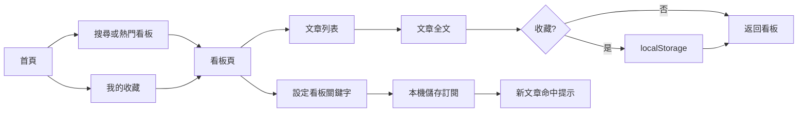

# OpenPTT · Product Requirements Document v4.2

> 文件狀態：Draft for product / UI alignment
> 更新日期：2026-09-23
> Single source of truth：本文件定義產品範圍；`PRD/UI-SPEC.md` 定義介面契約；`prototype/openptt.html` 是視覺溝通原型。

## 1. 產品定義

### 1.1 一句話

OpenPTT 是一個讓 PTT 使用者快速找到看板、掃讀文章、閱讀全文並保留個人收藏的跨平台閱讀器；它保留推、噓、箭頭、爆文等 PTT 語彙，但移除 BBS 操作的摩擦。

### 1.2 問題

PTT 的資訊密度高，但現有 Web / 行動介面在小螢幕上難以掃讀：看板入口分散、文章標題與推噓訊號層級不清、跨板回訪成本高。使用者需要的是「打開即看」而不是完整模擬終端機。

### 1.3 價值主張

| 對象 | 需求 | OpenPTT 的承諾 |
|---|---|---|
| 休閒讀者 | 5 分鐘掌握熱門討論 | 首頁以熱門板與熱門文章作為入口 |
| 重度跨板讀者 | 快速切換固定看板 | 收藏、最近瀏覽與明確的看板層級 |
| 行動使用者 | 單手掃讀，不迷路 | mobile bottom nav、卡片化資訊、清楚返回 |
| 隱私敏感使用者 | 不想註冊也能用 | guest-first；收藏與主題僅 localStorage |

### 1.4 Non-goals（MVP 明確不做）

- PTT 登入、發文、回文、推文、噓文、私人信箱與站內社交。
- 付費訂閱、廣告投放、雲端同步與跨裝置帳號；本版的「關鍵字訂閱」是免費的本機閱讀偏好，不是商業訂閱方案。
- 即時 WebSocket、推播、聊天室與影音內容。
- 自訂 CSS、複製完整 BePTT / PTT 終端機操作模型。
- 以瀏覽器端直接繞過 PTT 風控或宣稱未驗證的即時資料。

## 2. 目標、指標與假設

### 2.1 MVP 目標

1. 新使用者在 10 秒內找到一個想看的板。
2. 使用者在 3 次點擊內從首頁進入文章全文。
3. 使用者能在不登入的情況下收藏看板或文章，重新整理後仍保留。
4. 介面在 390px 寬度可單手操作，在桌面寬度可同時閱讀列表與上下文。

### 2.2 可觀測指標

| 指標 | MVP 目標 | 量測方式 |
|---|---:|---|
| 首屏可互動時間 | < 1.5s（static build） | Lighthouse / Web Vitals |
| 首頁 → 文章 | ≤ 3 clicks | 手動任務測試 |
| 搜尋回饋 | input 後 100ms 內更新 mock 結果 | performance mark |
| 主要流程可用性 | 10 位測試者中 8 位完成 | usability test |
| Accessibility | Lighthouse AA 方向；鍵盤可走完主流程 | axe / Lighthouse |

### 2.3 產品假設

- 第一階段讀者只需要閱讀；互動行為先以收藏與主題偏好驗證黏著度。
- 以「熱門訊號 + 看板分類 + 搜尋」取代複雜的推薦演算法。
- guest-first 能降低註冊阻力，但 localStorage 不是可靠資料庫；任何雲端同步都是後續明確 scope。

## 3. Personas 與主要任務

### Alex｜午休快速掃讀

- 桌面 Chrome、每天 5–10 分鐘。
- 任務：從「最近瀏覽」回到 Tech_Job，改以熱門排序，開一篇文章後返回。
- 成功：不需要記住 URL，不被多餘設定打斷。

### Betty｜手機追蹤固定看板

- Android 手機、單手操作。
- 任務：搜尋 NBA，收藏看板，閱讀熱門文章，切換深色模式。
- 成功：觸控目標至少 44px；返回與收藏狀態明確。

### Charlie｜跨板讀者

- 同時追蹤財經、科技、生活板。
- 任務：從首頁看熱門板 → 進板 → 回到收藏，再跳到另一篇收藏文章。
- 成功：不丟失上下文；收藏頁能分辨看板與文章。

## 4. 使用者流程與資訊架構

### 4.1 Sitemap

```text
OpenPTT
├── 首頁 / Dashboard
│   ├── 最近瀏覽
│   ├── 熱門看板
│   └── 熱門文章
├── 看板列表
│   ├── 搜尋 / 分類篩選
│   └── 看板頁
│       ├── 最新 / 熱門 / 板主推薦
│       └── 文章頁
├── 我的收藏
│   ├── 收藏看板
│   └── 收藏文章
└── 設定
    ├── 主題（系統 / 淺色 / 深色）
    └── 資料與隱私說明
```

### 4.2 核心流程



### 4.3 對標 App 功能拆解

參考截圖呈現的是一個以「主選單」為核心的 PTT App：將帳號、熱門、收藏、分組、歷史、看板搜尋、設定與關於集中在一個可垂直瀏覽的入口。OpenPTT 借用其功能地圖，但維持自己的 reading-first、guest-first 定位。

| 對標功能 | OpenPTT 決策 | 產品落點 |
|---|---|---|
| 動詞熱門 / 即時熱門 | 採用 | `FR-007` Dashboard 與熱門文章入口；先用示範資料，真實更新由 adapter 提供。 |
| 我的最愛 / 文章收藏 | 採用 | `FR-004` 收藏看板與文章，localStorage 持久化。 |
| 看板歷史 / 閱讀歷史 | 採用（P1） | `FR-009` 保存最近 10 個板 / 文，提供清除入口。 |
| 全站看板搜尋 | 採用 | `FR-001` 看板名稱、描述、分類即時搜尋；全文搜尋另列 `FR-008`。 |
| 指定看板關鍵字訂閱 | 正式採用（P1） | `FR-011` 綁定單一看板與 keyword；先做 in-app 命中提示，再評估推播。 |
| 分組討論 | 延後 | 需要定義群組模型與內容治理，避免與 PTT 公開文章概念混淆。 |
| 帳號、帳號切換、私人信件 | 不採用 | 與 MVP 的 guest-first / 純閱讀邊界衝突。 |
| 推文歷史、圖片上傳紀錄、水球紀錄 | 不採用 | 屬於登入互動或站內社交行為，不是本產品核心任務。 |
| 贊助 / 付費方案 | 延後 | 先驗證閱讀與訂閱使用率，不在本階段加入商業化 UI。 |
| 設定 / 關於 / 資料來源 | 採用 | 設定頁提供主題、本機資料清除、關鍵字訂閱管理與 mock / stale 說明。 |

## 5. 功能需求與 Acceptance Criteria

### P0：MVP 必須完成

| ID | 功能 | 狀態 | Acceptance Criteria |
|---|---|---|---|
| FR-001 | 看板探索 | shipped | AC-001：展示至少 30 個看板與 8 個分類；AC-002：可依名稱、描述、分類即時搜尋；AC-003：空結果有明確 empty state。 |
| FR-002 | 看板文章列表 | shipped | AC-004：每列展示標題、標籤、作者、時間、推/噓/箭頭；AC-005：最新、熱門、板主推薦三種排序可切換；AC-006：點擊列進入全文。 |
| FR-003 | 文章閱讀 | shipped | AC-007：展示標題、看板、作者、時間、推噓摘要與內文；AC-008：HTML 內容先經 DOMPurify；AC-009：文章不存在時顯示可返回的錯誤狀態。 |
| FR-004 | 收藏 | shipped | AC-010：可收藏看板與文章；AC-011：重新整理後保留；AC-012：收藏頁可移除與拖曳排序，並區分類型。 |
| FR-005 | 主題 | shipped | AC-013：支援系統、淺色、深色；AC-014：選擇持久化；AC-015：切換後文字與邊界仍符合對比要求。 |
| FR-006 | Guest-first | shipped | AC-016：不登入即可完成探索、閱讀、收藏與主題切換；AC-017：介面不出現假的登入門檻。 |

### P1：下一個產品 increment

| ID | 功能 | 目的 | 驗收方向 |
|---|---|---|---|
| FR-007 | 首頁 Dashboard | 降低回訪成本 | 最近瀏覽、收藏看板、熱門文章有穩定入口；首次使用有空狀態。 |
| FR-008 | 全文搜尋 | 從「找板」擴展到「找文」 | 搜尋標題與內容；顯示結果板名、時間、命中摘要；無結果可清除。 |
| FR-009 | 最近瀏覽 | 保留閱讀上下文 | 最近 10 個板 / 文 localStorage；可清除，不存內容以外的個資。 |
| FR-010 | 真實 PTT 資料 adapter | 進行中 | UI 只依賴 typed adapter；每個看板的 PTT 目前文章頁完整列出 20 筆，支援歷史頁翻頁；資料經 server-side proxy 取得並以 1 小時 cache window 更新，資料過期顯示 timestamp 與 stale state。 |
| FR-011 | 指定看板關鍵字訂閱 | 降低重複搜尋成本 | AC-018：從看板頁建立「看板 + 關鍵字」訂閱；AC-019：比對文章標題、內容與 tags；AC-020：訂閱可啟用、停用、刪除；AC-021：重新整理後保留；AC-022：命中只先提供 in-app 提示，不宣稱已接通推播。 |

### P2：驗證後才做

| ID | 功能 | 前置條件 |
|---|---|---|
| FR-012 | Web Push / APNs / FCM | 先完成關鍵字訂閱的命中規則與通知偏好，再驗證瀏覽器 / 原生權限流程。 |
| FR-013 | Capacitor iOS / Android | Web UI 完成 mobile QA，且定義原生權限策略。 |
| FR-014 | 多板 Dashboard 拖拽 | 先有足夠收藏與回訪資料，避免空功能。 |
| FR-015 | 虛擬滾動 | 以 profiling 證明長列表為瓶頸後才引入。 |

### FR-010 真實 PTT 資料 adapter Acceptance Criteria

- AC-023：`/board/:board` 預設載入該 PTT 看板目前文章頁的完整文章列，不再以固定 6 篇 mock 文章冒充真實資料。
- AC-024：看板頁可往較舊／較新的 PTT index page 翻頁；目前頁碼由 PTT source page 決定，不在前端虛構總頁數。
- AC-025：點擊真實文章後，由 server-side adapter 取得 PTT 全文、作者、時間與推噓摘要；瀏覽器不直接呼叫 `ptt.cc`。
- AC-026：adapter 回傳 `source`、`fetchedAt`、`staleAt`；UI 顯示資料來源與最近同步時間。
- AC-027：Vercel response 使用 `s-maxage=3600` 與 stale-while-revalidate；同一看板資料最多每小時重新抓取一次，手動重新整理可重新驗證。
- AC-028：PTT 回應逾時、看板受限或格式變更時，保留可閱讀的 mock fallback，並顯示「資料可能過期」錯誤狀態，不顯示假即時標籤。

「全部文章」的產品定義是「目前 PTT index page 的完整列 + 可翻頁的歷史 index pages」；不包含一次性下載 PTT 全站自建以來的無限歷史文章。文章全文採點擊載入，避免每小時抓取數百篇文章造成來源負載。

## 6. Domain 與資料契約

### 6.1 BoardMeta

```ts
interface BoardMeta {
  name: string
  category: string
  description: string
  subscribers: number
  isHot?: boolean
}
```

### 6.2 Article

```ts
interface Article {
  id: string
  board: string
  title: string
  author: string
  authorIp: string
  postedAt: string // ISO 8601
  content: string // sanitize before render
  tags: string[]
  pushes: number
  boos: number
  arrows: number
  isHot: boolean
  isPin: boolean
  pushToBooRatio?: number
  pushedToward: 'positive' | 'negative' | 'neutral'
  source?: 'mock' | 'ptt'
  sourceUrl?: string
  fetchedAt?: string
}

interface BoardFeedPage {
  board: string
  page: number // 0 = PTT 最新頁
  articles: Article[]
  hasOlder: boolean
  hasNewer: boolean
  fetchedAt: string
  staleAt: string
  source: 'ptt' | 'mock'
}
```

### 6.3 KeywordSubscription

```ts
interface KeywordSubscription {
  id: string
  board: string
  keyword: string
  enabled: boolean
  createdAt: number
}
```

規則：關鍵字以 trim 後的 case-insensitive substring 比對 `title`、`content` 與 `tags`；同一看板不可建立完全相同的啟用中訂閱；每筆訂閱只綁定一個看板。prototype 以 in-app 命中提示示範，production notification channel 另由 FR-012 定義。

### 6.4 Local storage

| Key | 內容 | 失敗策略 |
|---|---|---|
| `openptt:favorites` | 收藏看板 / 文章陣列 | try/catch；回退到 memory-only |
| `openptt:theme` | `light` / `dark` / `system` | 回退到 system preference |
| `openptt:recent`（P1） | 最近瀏覽 id 陣列 | 無法寫入時不阻斷閱讀 |
| `openptt:keyword-subscriptions`（P1） | `KeywordSubscription[]` | 無法寫入時不阻斷閱讀，顯示本次不會保留 |

不得儲存 PTT 密碼、token、email、完整 IP 歷史或任何不必要的個資。

## 7. 技術架構與降級

```text
React SPA / Vite
  ├── Router: board list → board → article
  ├── Domain: typed PTT adapter + mock fallback
  ├── Vercel Functions: server-side PTT HTML proxy / parser
  ├── Cache: Vercel CDN s-maxage 3600s + stale-while-revalidate
  ├── Storage: favorites + theme (localStorage)
  ├── Security: DOMPurify before HTML render
  └── Deploy: Vercel static output + serverless API
```

### 降級策略

- 資料 adapter 失敗：顯示最後一次可用資料與「資料可能過期」提示。
- PTT 看板受限或來源格式變更：不繞過登入／18 歲驗證／風控；回退 mock，並保留錯誤與最後同步時間。
- localStorage 不可用：功能仍可使用，但提示「本次瀏覽不會保留收藏」。
- 圖片載入失敗：顯示固定比例 placeholder，不讓文章排版跳動。
- 深色模式讀不到系統偏好：預設淺色。

## 8. 非功能需求

| 類別 | 要求 |
|---|---|
| Performance | FCP < 1.5s；production JS gzip 目標 < 300KB；列表避免不必要 re-render。 |
| Accessibility | 語意 heading；按鈕有 accessible name；鍵盤 focus visible；色彩不是唯一訊號；觸控目標 ≥ 44px。 |
| Responsive | 390px、768px、1440px 三個 QA viewport；mobile bottom nav，desktop sidebar。 |
| Security | DOMPurify；不把未信任內容插入 `innerHTML`；CSP 由部署層補上。 |
| Privacy | guest-first、無第三方追蹤、資料來源與 mock 狀態可見。 |
| Compatibility | 最新 Chrome、Safari、Firefox、Edge；iOS Safari PWA 先以 Web QA 覆蓋。 |

## 9. Definition of Done

### MVP（現況基線）

- [x] FR-001 ～ FR-006 完成且有對應測試。
- [x] TypeScript strict 通過。
- [x] Vitest 現有 10 條測試通過。
- [x] `npm run build` 通過。
- [ ] Lighthouse Performance / Accessibility ≥ 90：需在瀏覽器環境驗證。
- [ ] UI-SPEC 對應的 React visual QA：prototype 核准後進行。
- [ ] FR-011 關鍵字訂閱 production implementation：prototype 已示範，React / data adapter 尚未接入。

### 每個後續 feature

- 有 FR / AC 編號與測試案例。
- mobile + desktop 版面都有驗證。
- loading、empty、error、stale、success 狀態都有設計。
- deterministic checks 有 command output 與 exit code 證據。

## 10. Milestones

| Milestone | 內容 | 狀態 |
|---|---|---|
| M1 | 5 個 P0 + Web PWA 骨架 | ✅ |
| M2 | 33 個看板、分類、排序、搜尋、metadata | ✅ |
| M2.5 | PRD v4 + UI-SPEC + HTML prototype | 🔄 本次 |
| M3 | 以 UI-SPEC 重構 React visual layer + P1 Dashboard / recent / keyword subscription | ⏳ 待 prototype review |
| M4 | 真實 PTT 資料 adapter、文章全文 proxy、歷史頁翻頁、1 小時 stale state | 🔄 本次 |
| M5 | Mobile QA 後評估 Capacitor / notifications | ⏳ |

## 11. 風險與決策

| 風險 | 影響 | 決策 / 緩解 |
|---|---|---|
| PTT 資料來源或規則變更 | 高 | 將 adapter 與 UI 解耦；prototype 與 mock 不宣稱即時。 |
| 使用者以為可登入互動 | 中 | 全站 copy 明示「閱讀模式」與 guest 狀態。 |
| localStorage 清除或滿額 | 中 | try/catch + 不阻斷閱讀 + P1 提供清除與備份思路。 |
| UI 過度像管理後台 | 中 | 以 reading-first layout、文章層級與 board context 作為 UI-SPEC 核心。 |
| 真實資料帶入 HTML | 高 | DOMPurify；不允許未消毒內容渲染。 |
| PTT 來源限流或 Cloudflare 規則變更 | 高 | server-side adapter、每看板 1 小時 cache、逾時 fallback；不在瀏覽器繞過風控。 |

### ADR-001｜閱讀優先，不複製終端機

採卡片與清楚 typography 層級，保留 PTT 語意訊號但不複製等寬終端機排版。原因是目標包含手機與第一次接觸 PTT 的使用者。

### ADR-002｜Guest-first local-only MVP

在尚未驗證內容黏著與登入需求前，不引入 auth / DB / payment；收藏與主題使用 localStorage，並提供明確降級。

### ADR-003｜Prototype 與 production 分離

HTML prototype 位於 `prototype/`，可快速評審 UI flow，不污染 Vite bundle，也不把 prototype mock 當 production 完成證據。

## 12. 目前已知缺口

- `web/public/dashboard.html` 是舊的通用 dashboard 草稿，待 prototype 核准後移除或改成 redirect，避免兩套 UI source of truth。
- M4 第一階段只保證看板文章列表與文章全文真實來源；Dashboard / 熱門聚合仍可暫時使用 mock，待 adapter 聚合 API 另開 AC。
- `ci.yml` 的 lint job 目前可在沒有 lint script 時繼續通過；需另開 engineering debt 修正。
