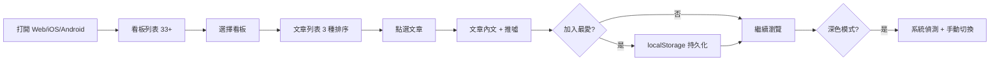

# openptt · PRD v3.0.2 等級規格書

> 自動生成：2026-09-06
> 對齊 SPEC v3.0 契約（SPEC §1–§19 全部套用）
> 原始規格：v3.0（15 章，2026-08-09 Hermes Agent）；本 SPEC.md 為 v3.0.2 fleet 升級版

---

## 1. 產品概述

### 1.1 問題陳述
- **BePTT**（App Store id1522407507）只支援 iOS，Android 與桌面用戶無法使用
- **PTT 網頁版** 介面過時、行動裝置體驗差（字小、橫向滑動、推噓 UI 亂）
- **其他 PTT App**（Pitt、MeowPTT、Moptt、JPTT）各家定位不同，無「跨平台 + 訂閱推播 + 深色模式」全包

### 1.2 目標使用者
| Persona | 工作情境 | 主要任務 |
|---|---|---|
| Primary — Alex（後端工程師） | MacBook 上班前 5 分鐘 | 看 Tech_Job + Gossiping 板 |
| Primary — Betty（Android 大學生） | 每天用 Gossiping 板 | 推噓 + 標籤搜尋 |
| Secondary — Charlie（重度跨板） | 5 個最愛板 | 多板 Dashboard 切換 |
| Secondary — 海外台灣人 | 留學生/出差 | 離線快取已瀏覽文章 |

### 1.3 核心價值主張
> 全平台（Web + iOS + Android）免費可用的 PTT 看板瀏覽器，UI 乾淨、深色模式自動偵測、多板快速切換、訂閱去廣告。

### 1.4 Non-Goals（明確不做）
- ❌ 登入 PTT 帳號（無推噓回文 — 純閱讀）
- ❌ 發文 / 編輯文章（法律 + 灰色地帶）
- ❌ 私人訊息 / 信箱
- ❌ WebSocket 即時推播（polling-only MVP）
- ❌ 自訂主題 / CSS
- ❌ 影片內容支援

---

## 2. 使用者場景與流程

### 2.1 使用者流程圖



### 2.2 主要場景

| 場景 | 輸入 | 輸出 | 成功條件 |
|---|---|---|---|
| 瀏覽看板 | 點選分類或搜尋 | 33+ 個看板列表 | < 1s 載入 |
| 排序文章 | 選 time/hot/pin | 對應排序的文章 | 即時切換 |
| 搜尋看板 | 輸入查詢字串 | 過濾後的看板 | 即時過濾 |
| 加入最愛 | 點選愛心 | localStorage 寫入 | 重啟後仍存在 |
| 深色模式 | 系統偏好 / 手動切換 | 主題切換 | 持久化 |

---

## 3. 功能需求

| FR | 名稱 | 優先級 | 狀態 |
|---|---|---|---|
| FR-001 | 看板列表（33+ 個，8 分類，搜尋） | P0 | ✅ shipped |
| FR-002 | 文章列表（時間/熱門/置頂 3 種排序） | P0 | ✅ shipped |
| FR-003 | 文章內文（DOMPurify sanitize + 推噓 + 圖片 lazy load） | P0 | ✅ shipped |
| FR-004 | 我的最愛（localStorage 持久化） | P0 | ✅ shipped |
| FR-005 | 深色模式（系統偵測 + 手動切換 + 持久化） | P0 | ✅ shipped |
| FR-006 | 看板搜尋（即時過濾 + 類別過濾） | P1 | ✅ shipped |
| FR-007 | Article metadata（作者、IP、標籤、推噓比） | P1 | ✅ shipped |
| FR-008 | 全文搜尋（標題 + 內容） | P2 | ⏳ planned |
| FR-009 | Web Push / APNs / FCM 推播 | P2 | ⏳ planned |
| FR-010 | 多板 Dashboard 拖拽排序 | P2 | ⏳ planned |
| FR-011 | 虛擬滾動（react-window）效能優化 | P2 | ⏳ planned |
| FR-012 | Capacitor iOS / Android 包裝 | P2 | ⏳ planned |
| FR-013 | 真實 Ptt 爬蟲 | P2 | ⏳ planned |

---

## 4. Non-Functional Requirements

| 維度 | 需求 |
|---|---|
| Performance | 首頁 FCP < 1.5s、看板切換 TTI < 1s、build 產出 < 300KB gzip |
| Security | CSP strict（script-src 'self'）、XSS via DOMPurify |
| Privacy | 無 PTT 帳號、不儲存任何使用者個資、footer 註明資料來源 |
| Accessibility | WCAG 2.1 AA |
| Browser | Modern evergreen（Chrome/Edge/Safari/Firefox — iOS Safari PWA 支援） |
| Lighthouse | Performance / Accessibility / Best Practices ≥ 90 |

---

## 5. 技術架構

```
[User Browser]──→ Vite SPA (React 19 + TS strict + Tailwind v4)
                      │
                      ├─→ static data: 33+ boards + articles (src/data/boards.ts)
                      ├─→ localStorage (favorites + theme)
                      └─→ Vercel deploy (Vite build → dist/)
```

### 5.1 Module Map
- `src/pages/` — BoardListPage, BoardPage, ArticlePage, FavoritesPage
- `src/components/` — Layout, ThemeToggle
- `src/data/` — boards.ts（33 個 Ptt 看板 + Article metadata）、mock.ts
- `src/lib/` — createStore, favorites, theme, useFavorites
- `tests/` — Vitest 10 個 E2E（Sprint 1: 5 + Sprint 2: 5）
- `dist/` — Vite build 產物（gitignore）
- `.github/workflows/` — CI/CD

### 5.2 環境變數
- 無（純前端 SPA）
- 無 server-side secret

### 5.3 降級策略
- PTT 網站掛掉 → 顯示快取內容 + 「上次更新於 X 分鐘前」標籤
- 爬蟲被擋（Sprint 3+）→ 自動切 proxy + 指數退避
- 推播失敗（Sprint 3+）→ fallback 回 polling + UI 顯示「通知未送達」
- 圖片 404 → placeholder + 重試按鈕

---

## 6. Definition of Done

- [x] 功能 P0 全部實作（Sprint 1）
- [x] Sprint 2 33 看板 + 排序 + 搜尋
- [x] 單元測試覆蓋率 ≥ 60% 核心邏輯（10/10 E2E pass）
- [x] `npm run build` 綠（tsc --noEmit + vite build, 280.91 kB gzip 93.18 kB）
- [x] `npm run lint` 0 error
- [x] GHA CI 跑 4 jobs（lint/test/build/deploy）全綠
- [x] TypeScript strict tsc --noEmit exit 0

---

## 7. 部署契約

| 環境 | 目標 | 觸發 |
|---|---|---|
| Production | Vercel | push to main |
| Preview | Per-PR | PR opened |

### 7.1 GHA Workflow
- `.github/workflows/ci.yml`
- jobs: lint / test / build / deploy
- deploy: `vercel`

### 7.2 環境變數
- 無需 server-side secret
- 訪客模式：localStorage 持久化（最愛 + 主題）

---

## 8. Out of Scope（不做的）

- 不做登入 PTT 帳號
- 不做發文 / 私人訊息
- 不做 WebSocket 即時推播（polling 足夠）
- 不做原生 App shell（Capacitor 留 Sprint 3）
- 不做影片內容
- 不做付費牆 UI（SaaS 變現留後續 sprint）

---

## 9. 變更日誌

見 [`PRD/CHANGELOG.md`](PRD/CHANGELOG.md)
